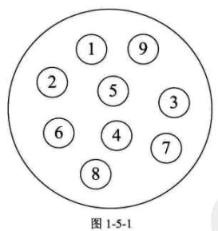
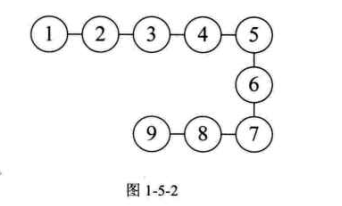
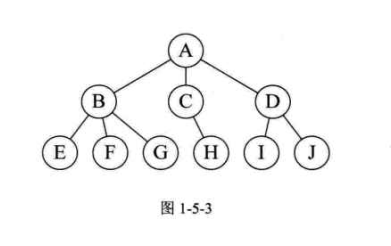
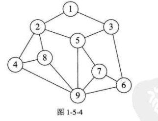
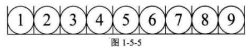
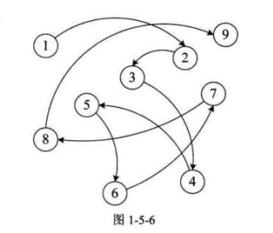

>   数据结构是一门研究非数值计算的程序设计问题中的**操作对象**，以及它们之间的**关系**和**操作**等相关问题的学科。

#### 1.4 基本概念和术语

##### 1.4.1 数据

描述客观事物的符号，是计算机中可操作的对象，是能被计算机识别，并输入给计算机处理的符号集合。

符号成为数据的2个前提：

-   可以输入到计算机；
-   能被计算机程序处理。

##### 1.4.2 数据元素

是组成数据的，有一定意义的基本单位，在计算机中通常作为整体处理。也被称为`记录`。

##### 1.4.3 数据项

是数据不可分割的最小单位。一个数据元素可以由若干个数据项组成。

##### 1.4.4 数据对象

性质相同的数据元素的集合，是数据的子集。

##### 1.4.5 数据结构

**结构：** 不同数据元素之间存在的特定的关系。

**数据结构：** 是相互之间存在一种或者多种特定关系的数据元素的集合。

####  1.5 逻辑结构与物理结构

##### 1.5.1 逻辑结构

指数据对象中的数据元素之间的相互关系【也是最需要关注的问题】。

逻辑结构是针对具体的问题的，是为了解决某个问题【选择合适的数据结构表示数据元素的关系】。

**1. 集合结构**

集合结构中的数据元素除了同属于一个集合外，它们之间没有任何其他关系【共同属性仅仅是同属于一个集合】。如图1-5-1：

**2. 线性结构**

线性结构中的数据元素之间的关系是一对一的关系。如图1-5-2：

**3. 树形结构**

树形结构中的数据元素之间存在一种一对多的层次关系。如图1-5-3：

**4. 图形结构**

图形结构的数据元素是多对多的关系。如图1-5-4：

在用示意图表示数据的逻辑结构时，需要注意：

-   将每一个数据元素看做一个节点，用圆圈表示；
-   元素之间的逻辑关系用节点之间的连线表示，如果这个关系有方向，那么就用带箭头的连线表示。

##### 1.5.2 物理结构

物理结构是指数据的逻辑结构在计算机中的存储形式。

**1. 顺序存储结构** 

把数据元素存放在地址连续的存储单元里，其数据间的逻辑关系和物理关系一致。如图1-5-5：

**2. 链式存储结构**

把数据元素存放在任意的存储单元里，这组存储单元可以是连续的，也可以是不连续的。数据元素的存储关系并不能反映其逻辑关系，因此需要一个指针存放数据元素的地址，以找到相关数据元素的位置。如图1-5-6：

#### 1.6 抽象数据类型

##### 1.6.1 数据类型

数据类型是指一组性质相同的值的集合以及定义在此集合上的一些操作的总成。

`C语言` 中数据类型根据取值不同的分类：

-   原子类型：不可以再分解的基本类型，比如整型，实型，字符型等等；

-   结构类型：由若干个类型组合而成，是可以再分解的。比如整型数组是若干整型数据组成。

    

##### 1.6.2 抽象数据类型

抽象是指抽取出事物具有的普遍性的本质，**抽象**的意义在于数据类型的数学抽象特征。

抽象数据类型[Abstract Data Type, ADT] 是指一个数学模型及定义在该模型上的一组操作。

描述抽象数据类型的标准格式如下：

>   ADT 抽象数据类型名称
>
>   Data
>
>   ​		数据元素之间的逻辑关系定义
>
>   Operations
>
>   ​		操作1
>
>   ​				初始条件
>
>   ​				操作结果描述
>
>   ​		操作2
>
>   ​				.。。。。
>
>   ​		操作n
>
>   endADT    

#### 1.7 总结

数据结构是相互之间存在一种或者多种特定关系的数据元素的集合。

|         |         |         |   数    |   据    |         |         |         |
| :-----: | :-----: | :-----: | :-----: | :-----: | :-----: | :-----: | :-----: |
|         |         |   数    |   据    |   对    |   象    |         |         |
|  数据   |  元素   |  数据   |  元素   |  数据   |  元素   |  数据   |  元素   |
| 数据项1 | 数据项2 | 数据项1 | 数据项2 | 数据项1 | 数据项2 | 数据项1 | 数据项2 |

| 逻辑结构 |   物理结构   |
| :------: | :----------: |
| 集合结构 | 顺序存储结构 |
| 线性结构 | 链接存储结构 |
| 树形结构 |              |
| 图形结构 |              |

