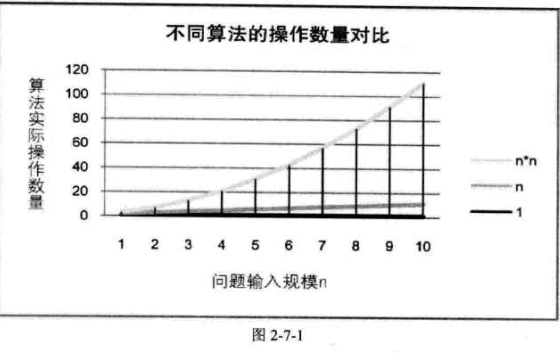
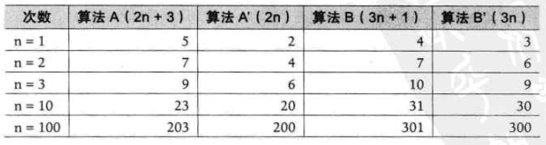
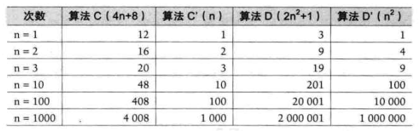
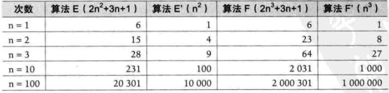
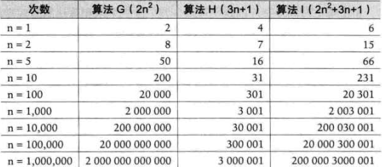

>   算法：解决特定问题求解步骤的描述。在计算机中表现为指令的有限序列，并且每条指令表示一个或多个操作。


#### 2.2 数据结构和算法之间的关系

（算法是为了更好的理解数据结构。。。）


#### 2.3 两种算法的比较

以1-100的累加为列子：

1.  普通算法

    ```java
    public class SumInt {
        public static void main() {        
    		int result = 0;
            for(int i=1; i<=100; i++) {
               result = result + i; 
            }          
        }
    }
    ```

2.  高斯算法

    ```java
    public class SumInt {
        public static void main() {        
     		int n = 100;
            int result;        
            result = (1 + n) * (n / 2);        
        }
    }
    ```

    【这里的算法就是为了解决1-100累加的这个特定的问题】

    

#### 2.4 算法的定义

算法：解决特定问题求解步骤的描述。在计算机中表现为指令的有限序列，并且每条指令表示一个或多个操作。某一种特定的算法是为了解决某一类特定的问题而存在，没有任何一种算法可以解决所有问题。


#### 2.5 算法的特征

算法具有五个基本特性：【输入】【输出】【有穷性】【确定性】【可行性】


##### 2.5.1 输入输出

算法具有零个或者多个输入【可以理解为参数】，至少有一个或者多个输出【即结果】。

如果输出为零个，那么该算法不具有任何意义【不解决任何问题】。


##### 2.5.2 有穷性

算法有穷性是指在执行有限的步骤之后，自动结束而不会出现无线循环的情况，并且每一个步骤都应该在可接受的时间内完成【永远执行的算法没有意义】。


##### 2.5.3 确定性

确定性是指算法的每一步骤都具有确定的含义，不会出现二义性。


##### 2.5.4 可行性

算法的每一步都必须是可行的，也就是说，每一步都能够通过执行有限的次数完成。


#### 2.6 算法设计的要求

正确性，可读性，健壮性，时间效率高和存储量低，


##### 2.6.1 正确性

算法正确性是指算法至少应该具有输入，输出和加工处理无歧义性，能正确反映问题的需求，能够得到问题的正确答案。大体上可以分为四个层次：

1.  算法程序没有语法错误【最低层次】；
2.  算法程序对于合法的输入数据能够产生满足要求的输出结果；
3.  算法程序对于非法的输入数据能够得出满足规格说明的结果【一般情况下该层次作为一个算法是否正确的标准】；
4.  算法程序对于精心选择的，甚至刁难的测试数据都有满足要求的输出结果【最高层次，通常只能在数学层面上证明】；


##### 2.6.2 可读性

算法设计的另一个目的是为了便于阅读，理解和交流。

【可读性是代码好坏的一个重要标准】


##### 2.6.3 健壮性

当输入数据不合法时，算法应该也能做出相关的处理，而不是产生异常或者莫名其妙的结果。


##### 2.6.4 时间效率高和存储量低

时间效率是指算法解决问题需要的时间总和；

存储量是指解决问题过程中需要的物理空间【内存和外部硬盘空间】；

比如“空间换时间”这个概念就是指牺牲物理空间以节省过程需要的时间。


#### 2.7 算法效率的度量方法

-   事后统计方法
-   事前分析估算方法


##### 2.7.1 事后统计方法

通过设计好的测试程序和数据，利用计算机计时器对不同算法编制的程序运行时间进行比较，从而确定算法效率的高低。其缺陷如下：

-   必须更具算法事先编制好程序【浪费额外的时间和精力，还不能保证该程序是否有效】
-   受计算机硬件及软件等因素影响太大，不能确定算法本身的优劣【比如老旧电脑和高配置电脑运行同一个程序的时间是明显不同的】
-   算法的测试数据设计困难【算法还受到测试数据规模的影响，比如10个数字的排序和100万个数字的排序】

**通常都不采用事后统计的方法**


##### 2.7.2 事前分析估算方法

在计算机程序编写之前，依据统计方法对算法进行估算。

高级程序语言编写运行所消耗的时间取决于下面几个因素：

1.  算法采用的策略，方法【主要因素】；

2.  编译产生的代码质量；

3.  问题输入的规模；

4.  机器执行指令的速度。【机器运行速度是一个确定因素】

    

    **一个程序的运行时间，依赖于算法的好坏和问题的输入规模。【问题输入规模是指输入数据量的多少】**

    

再次以1-100的累加算法说明：

1.  第一种算法【共执行 1 + (n+1) + n + 1 = 2n + 3 次】：

    ```java
    public class SumInt {
        public static void main() {        
    		int result = 0;              // 执行1次
            for(int i=1; i<=100; i++) {  // 执行了 n+1 次
               result = result + i;      // 执行了 n 次， 取值
            }          
            System.out.println(result);  // 执行了 1 次
        }
    }
    ```

2.  高斯算法【共执行 1+1+1+1 = 4 次】：

    ```java
    public class SumInt {
        public static void main() {        
     		int n = 100;                 // 执行了 1 次
            int result;                  // 执行了 1 次
            result = (1 + n) * (n / 2);  // 执行了 1 次 取值
            System.out.println(result);  // 执行了 1 次  
        }
    }
    ```

    

结论：忽略到变量声明，执行输出语句，把循环体看作一个整体，那么就会发现两种算法执行的次数是 n次 和 1次的却别。

-   **对算法的扩展**【随着n的增加，需要运行的次数远远多于前面两种算法】：

    ```java
    public class SumInt {
        public static void main() {
            int result = 0;
            int tmp = 0;
            int n = 100;
            for(int i=1; i<=n; i++) {
                for(int j=1; j<=n; j++) {
                    tmp++;                    // 执行 n² 次
                    result += tmp;            // 执行 n² 次
                }
            }
        }
    }
    ```

    **分析程序的运行时间时，最重要的是把程序看成独立于程序设计语言的算法或者一些列步骤。**

    【即忽略掉循环索引的递增和循环终止条件，变量声明，打印结果等等操作】

-   **表格说明**
	
|    算法    | 运行次数的函数 |
| :--------: | :------------: |
| 第一种算法 |    f(n) = n    |
| 第二种算法 |    f(n) = 1    |
| 第三种算法 |   f(n) = n²    |

-   **图示如下**：




#### 2.8 函数的渐近增长

>   给定两个函数 `f(n)` 和 `g(n)`，如果存在一个整数`N`，使得对于所有的`n > N`，`f(n)`总是比`g(n)`
>
>   大，那么就可以说 `f(n)` 的增长渐近快于 `g(n)`。
>
>   

算法【2n+3】和【3n+1】：

​						随着n的增大，+3 和 +1 这些加法常数对结果的影响可以忽略不计。

​						当n=1时，A不如B；

​						当n=2时，A和B相当；

​						输入规模 n 在没有限制的情况下，只要超过一个数值 N，这个函数就总是大于另一个函数，

​						我们称函数是渐近增长的。




算法【4n+8】和【2n²+1】:

​						当 n 达到一定规模后，常数[+8, +1] 和 与 n相乘的常数对结果的影响可以忽略不计；

​						也就是说，与最高次项相乘的常数并不重要。 




算法【2n²+3n+1】和【2n³+3n+1】：

​					当 n=1 时，E和F结果相同，但是当 n > 1后，E明显要优于F；

​					最高次项的指数大的，函数随着n的增长，结果也会变得增长特别快【n³ 增长要快于 n²】。




算法【2n²】【3n+1】【2n²+3n+1】：

​						随着 n 的增大，当达到一定规模之后，常数影响已经可以忽略不记了；

​						判断一个算法的效率时，函数中的常数和其他次要项常常可以忽略，而更应该关注

​						主项【最高阶项】的阶数。




**结论：**某个算法，随着 n 的增大，它会越来越优于另一个算法，或者越来越差于另一个算法。这就是事前估算方法的理论依据，通过算法的时间复杂度来估算算法的时间效率。


#### 2.9 算法的时间复杂度


##### 2.9.1 算法时间复杂度的定义

>   **在进行算法分析时，语句总的执行次数 T(n) 是关于问题规模 n 的函数，进而分析 T(n) 随 n的变化情况确定 T(n)的数量级。算法的时间复杂度，也就是算法的时间量度。记作：T(n) = O(f(n))。它表示随着问题规模n的增大，算法执行时间的增长率和f(n)的增长率相同，称作算法的渐近时间复杂度，简称为时间复杂度。其中 f(n) 是问题规模 n 的某个函数。**


大写 O( ) 来体现算法的时间复杂度记法，称为 **大O记法**

随着 n 的增大，T(n) 增长最慢的算法为最优算法。

按照时间复杂度的定义，之前的3个计算1-100累加的算法可以归纳为：

|    算法    | 记法  |  名称  |
| :--------: | :---: | :----: |
| 第一种算法 | O(n)  | 线性阶 |
|  高斯算法  | O(1)  | 常数阶 |
|  算法扩展  | O(n²) | 平方阶 |


##### 2.9.2 推导大O阶的方法

1.  用常数 1 取代运行时间中的所有加法常数；
2.  在修改后的运行次数函数中，只保留最高阶项；
3.  如果最高阶项存在且不是 1，则去除与这个项相乘的常数。

通过这3个步骤之后得到的结果就是 **大O阶。**

*备注：事实上，分析一个算法的时间复杂度，并没有这么简单*


##### 2.9.3 常数阶

推导高斯算法的 大O 记法

```java
public class SumInt {
    public static void main() {        
 		int n = 100;                 // 执行了 1 次
        int result;                  // 执行了 1 次
        result = (1 + n) * (n / 2);  // 执行了 1 次 取值 
        System.out.println(result);  // 执行了 1 次  
    }
}
```

这个算法的运行次数函数为 f(n) = 4 【记作：O( 4 )】, 根据推导 大O 方法，第一步就是把常数项 3 改为 1，由于没有最高阶，所以这个算法的时间复杂度为 O(1)。

该算法中，不管n的值是多少，代码执行的次数是不变的；

对于分支结构而言，无论真还是假，执行的次数是恒定的，不会随着 n 的变大而发生变化，所以单纯的分支结构（不包含在循环中），其时间复杂度也是 O(1)。


##### 2.9.4 线性阶

对于线性阶，分析算法的复杂度，关键就是要分析循环结构的运行情况。

```java
public class SumInt {
    public static void main() {        
		int result = 0;  
        int n = 100;
        for(int i=1; i<=n; i++) {
           result = result + i;      // 循环执行了 n 次
        }          
        System.out.println(result);  
    }
}
```

该算法的时间复杂度为 O(n)，因为循环体中的代码要执行 n 次。


##### 2.9.5 对数阶

每次 count * 2之后，就距离 n 更加接近，就是说：有多少个 2 相乘后大于 n 后退出循环。

由  2<sup>x</sup>  = n，得到 x = ㏒₂n，这个循环的时间复杂度记为 O(㏒n)。

```c
int count = 1;
while （count < n) {
    count = count * 2;
    /* 时间复杂度为 O(1) 的程序步骤序列 */
}
```


##### 2.9.6 平方阶

下面的代码时间复杂度为 O(n²)

```c
int i,j;
for(i=0; i<n; i++) {
    for(j=0; j<n; j++) {
        /* 这里是时间复杂度为 O(1) 的程序步骤序列 */
    }
}
```

如果上述代码中的外城循环 n 改为 m, 那么时间复杂度就为: O(m * n)。

**循环的时间复杂度等于循环体的复杂程度乘以该循环运行的次数。**


一个更加复杂的例子：

```c
int i,j;
for(i=0; i<n; i++) {
    for(j=i; j<n; j++) {
        /* 时间复杂度为 O(1) 的程序步骤序列 */
    }
}
```

总的执行次数为：n²/2 + n/2

大O 阶推导过程：

1.  没有加法常数不予考虑；

2.  只保留最高阶，因此去掉 n/2;

3.  去除最高阶的相乘的常数，即去掉 1/2；

    最终结果为：O(n²)


另一个列子：

这个列子实际上就是打印参数 i，所以是时间复杂度为 O(n)。

```java
public class Demo03 {
    public static void main(String[] args) {
        for(int i=0; i<n; i++) {
            func(i); // 调用了一个函数 func
        }
    }
    
    public static void func(int count) {
        System.out.print(count); /* O(1) 的程序步骤序列 */
    }
}
```

修改上面的代码：

```java
public class Demo03 {
    public static void main(String[] args) {
        for(int i=0; i<n; i++) {
            func(i); // 调用了一个函数 func
        }
        
        for(int i=0; i<n; i++) {
            for(int j=0; j<n; j++) {
                 /* O(1) 的程序步骤序列 */
            }
        }
    }
    
    public static void func(int count) {
        System.out.print(count); /* O(1) 的程序步骤序列 */
    }
}
```

修改后的执行次数为：1 + n + n² + (n(n+1))/2 = 3/2 * n² + 3/2 * n + 1

去除常数 => 3/2 * n² + 3/2 * n

去除最高阶之外的项 => 3/2 * n²

去除最高阶的常数乘数 => n²

结果仍然是 O(n²)。


#### 2.10 常见的时间复杂度

表格统计如下：

|      执行次数       |   阶    | 非正式术语 | 时间复杂度【越小表示越优】 |
| :-----------------: | :-----: | :--------: | :--------: |
|         12          |  O(1)   |   常数阶   |   1   |
|       2n + 3        |  O(n)   |   线性阶   |   3   |
|    3 n² + 2n + 1    |  O(n²)  |   平方阶   |   5   |
|     5㏒₂n + 20      | O(㏒n)  |   对数阶   |   2   |
|  2n + 3n㏒₂n + 19   | O(n㏒n) |   n㏒n阶   |   4   |
| 6n³ + 3 n² + 3n + 4 |  O(n³)  |   立方阶   |   6   |
|    2<sup>n</sup>                 | O(2<sup>n</sup>) | 指数阶 | 7 |

*备注：对于O(n³)，O(2<sup>n</sup>)这些情况，会让结果变得过大而不现实，一半都不会考虑。*


#### 2.11 最坏情况与平均情况

***最坏情况运行时间是一种保证，那就是运行时间将不会再坏了。在应用中，这是一种最重要的需求，通常，除非特别指定，我们提到的运行时间都是最坏情况的运行时间。***

***平均运行时间是所有情况中最有意义的，因为它是期望运行的时间，但实际中平均运行时间很难获得。***

**例子：**查找一个有 n 个随机数字数组中的某个数字，最好的情况就是第一个数字就是，那么算法时间复杂度为 O(1)，最坏的情况是这个数字在最后一个，那么时间复杂度为 O(n)。这个数字从概率角度看，出现在每一个位置的可能性是相同的，所以平均查找的时间为 n/2 次。


#### 2.12 算法空间复杂度

>   算法的空间复杂度通过计算算法所需的存储空间实现，算法空间复杂度的计算公式记作：
>
>   **S(n) = O(f(n))**
>
>   其中，n 为问题的规模，f(n) 为语句关于 n 所占存储空间的函数。

比如：

***对于闰年的算法：***

通过空间换时间，把需要判断的所有年份存在存储空间中，把闰年年份标记出来，那么时间复杂度就可以变成：O(1)。

**通常情况下，说到算法都是说算法的时间复杂度问题！！**


#### 2.13 总结回顾

1.  算法定义
2.  算法特性
3.  算法设计的要求
4.  算法设计与特性要区分开【容易混淆】
5.  算法的度量方法【两种】
6.  对比算法优劣，关键是看算法的关键执行次数函数的渐近增长性
7.  推导大 O 阶
8.  常见时间复杂度的排序
9.  算法的最坏情况和平均情况
10.  空间复杂度

