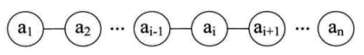
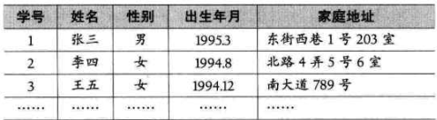
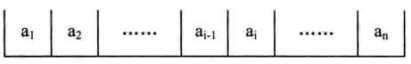
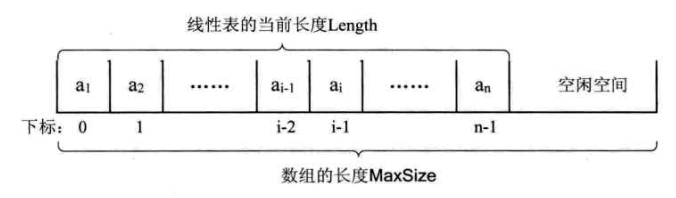
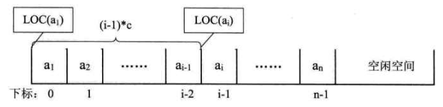

>   **线性表:**	零个或者多个数据元素的有限序列.


#### 3.2 线性表的定义

-   首先,它是一个序列 [ 也就是说,元素之间是有顺序的 ];

-   然后 , 线性表是有限的;

-   数学定义如下:

    **(a₁, .... , a<sub>i-1</sub>, a<sub>i</sub>, a<sub>i+1</sub>, ... , a<sub>n</sub>)**
    **表中的 a<sub>i-1</sub> 领先于 a<sub>i</sub>, 称 a<sub>i-1</sub> 是 a<sub>i</sub> 的直接前驱元素, a<sub>i+1</sub> 是 a<sub>i</sub> 的直接后继元素;**
    
    **当 i = 1, 2, ... , n-1 时, a<sub>i</sub> 有且仅有一个直接后继元素;**
    **当 i = 2, 3, ... , n 时, a<sub>i</sub> 有且仅有一个直接前驱元素.**
    
    
    
    **线性表元素的个数 n (  n>=0 ) 定义为线性表的长度, 当 n = 0 时,称为空表.**

-   在复杂的线性表中,一个数据元素可以由若干个数据项组成.

    


#### 3.3 线性表的抽象数据类型

-   ADT 线性表 ( List )

-   Data

    线性表的数据对象集合为 { a<sub>1</sub>, a<sub>2</sub>, ... , a<sub>n</sub>  }, 每个元素的类型均为 DataType. 其中, 除第一个元素 a<sub>1</sub> 外, 每一个元素有且只有一个直接前驱元素, 除了最后一个元素 a<sub>n</sub> 外, 每一个元素有且只有一个直接后驱元素. 数据元素之间的关系是一对一的关系.

-   Operation

    **InitList ( *L ):**  初始化操作,建立一个空的线性表 L
    **ListEmpt ( L ):**  若线性表为空, 返回 true, 否则返回 false
    **ClearList ( *L ):**  清空线性表
    **GetElem ( L, i, *e ):** 将线性表中的第 i 个位置的元素值 返回给 e
    **LocateElem ( L, e ):**  在线性表 L 中查找与给定值 e 相等的元素,如果成功,返回该元素在表中的序号则表示成功; 否则, 返回 0 表示失败
    **ListInsert ( *L, i, e ):**  在线性表 L 中的第 i 个位置插入新元素 e
    **ListDelete ( *L, i, *e ):** 删除线性表 L 中的第 i 个元素, 并用 e 返回其值
    **ListLength ( L ):**  返回线性表 L 的元素个数,即表的长度
    
-   endADT

-   实现一个 表A 和 表B 并集的需求,代码如下:

    ```c
    // La => A表; Lb => B表
    void union (List *La, List Lb) {
        int La_len, Lb_len, i;
        ElemType e;  /* 声明与 La 和 Lb 相同的数据元素 e */
        La_len = ListLength(La); /* 表的长度 */
        Lb_len = ListLength(Lb);
        
        for(i=1; i<=Lb_len; i++) {
            GetElem(Lb, i, e); /* 获取 Lb 中的第 i 个数据元素赋值给 e */
            if(!LocateElem(La, e, equal)) /* La 中不存在和 e 相同的数据元素 */
                ListInsert(La, ++La_len, e);  /* 插入这个元素到 La 表的最后 */       
        }
    }   
    ```

    


#### 3.4 线性表的顺序存储结构

##### 3.4.1 顺序存储定义

>   线性表的顺序存储结构,指的是用一段**地址连续的存储单元依次存储**线性表的数据元素.

顺序存储示意图:




##### 3.4.2 顺序存储方式

由于线性表中的数据元素类型一致,所以可以用 [ 计算机语言 ]的一维数组实现顺序存储结构. 即把第一个数据元素存储到数组下标为 0 的位置中.

顺序存储的结构代码:

```c
#define MAXSIZE 20 /* 存储空间初始分配容量 */

typedef int ElemType; /* ElemType 类型根据实际情况而定, 这里假设为 int */

typedef struct {
    ElemType data[MAXSIZE]; /* 数组存储数据元素, 最大值为 MAXSIZE */
    int length;  /* 线性表当前长度 */    
} SqList;
```

顺序存储结构需要的三个属性:

-   存储空间的起始位置: 数组 data, 它的存储位置就是存储空间的存储位置
-   线性表的最大存储容量: 数组长度 MAXSIZE
-   线性表的当前长度: length


##### 3.4.3 数组长度和线性表长度的区别

-   **数组的长度是存放线性表的内存存储空间长度,这个值一般是分配完成后就固定不变的**,比如能乘坐25人的公共汽车,这个汽车的乘客容量就可以看成是数组的长度,是固定的
-   **线性表的长度是指表中数据元素的个数,随着插入,删除操作的进行,长度是变化的**, 比如公交车上的乘客人数,随着乘客上下车,人数在变化中


##### 3.4.4 地址计算方法

数据元素的序号和存放它的数组下标之间的对应关系 [序号为 i 的元素,下标为 i-1]:



*因为线性表中可以进行插入,删除操作,因此分配的数组空间因该要大于等于当前线性表的长度.*

**内存存储器中的每个存储单元都有自己的编号,这个编号称为地址.**

假设每个数据需要占用的存储单元是 c 个, 那么线性表中的第 i+1 个数据元素的存储位置和第 i 个数据元素的存储位置满足下列关系 ( LOC 表示获得存储位置的函数 )

>   **LOC(a<sub>i+1</sub>) = LOC(a<sub>i</sub>) + c**

   所以对于第 i 个数据元素 a<sub>i</sub> 的存储位置可以由 a<sub>1</sub> 推算出:

>   **LOC(a<sub>i</sub>) = LOC(a<sub>1</sub>) + (i - 1) * c**



通过公式 **LOC(a<sub>1</sub>) = LOC(a<sub>i</sub>) + (i - 1) * c** 可以随时算出线性表中任意位置的地址,不管是第一个还是最后一个,那么对每个线性表位置的存入和取出数据都是相等的时间,也就是一个常数,因此从时间复杂度的概念来说,**存取时间性能为 O(1). 通常把具有这一特点的存储结构称为随机存储结构.**

